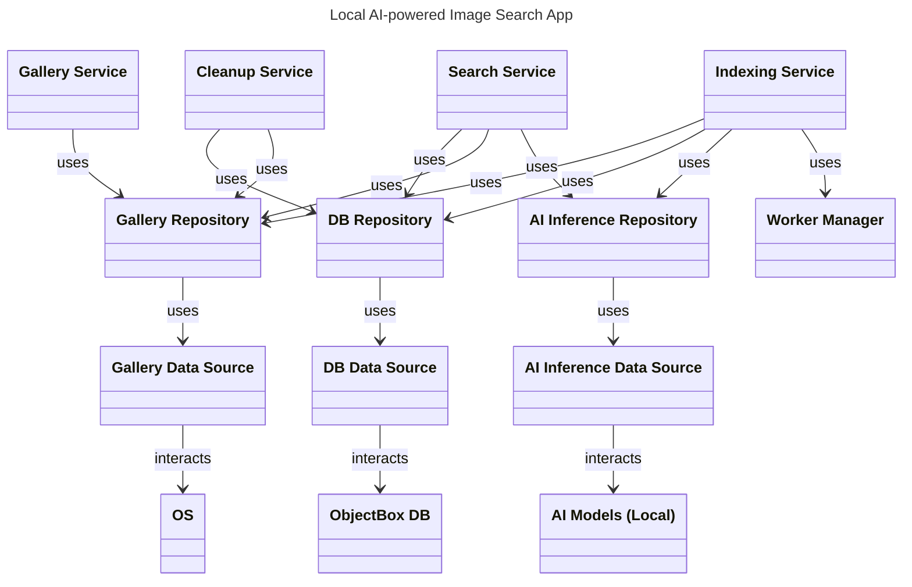
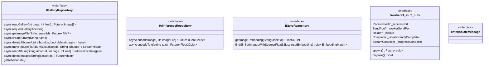
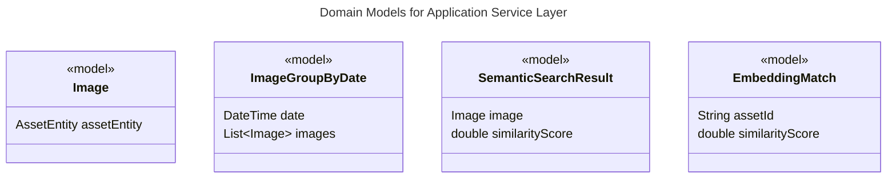
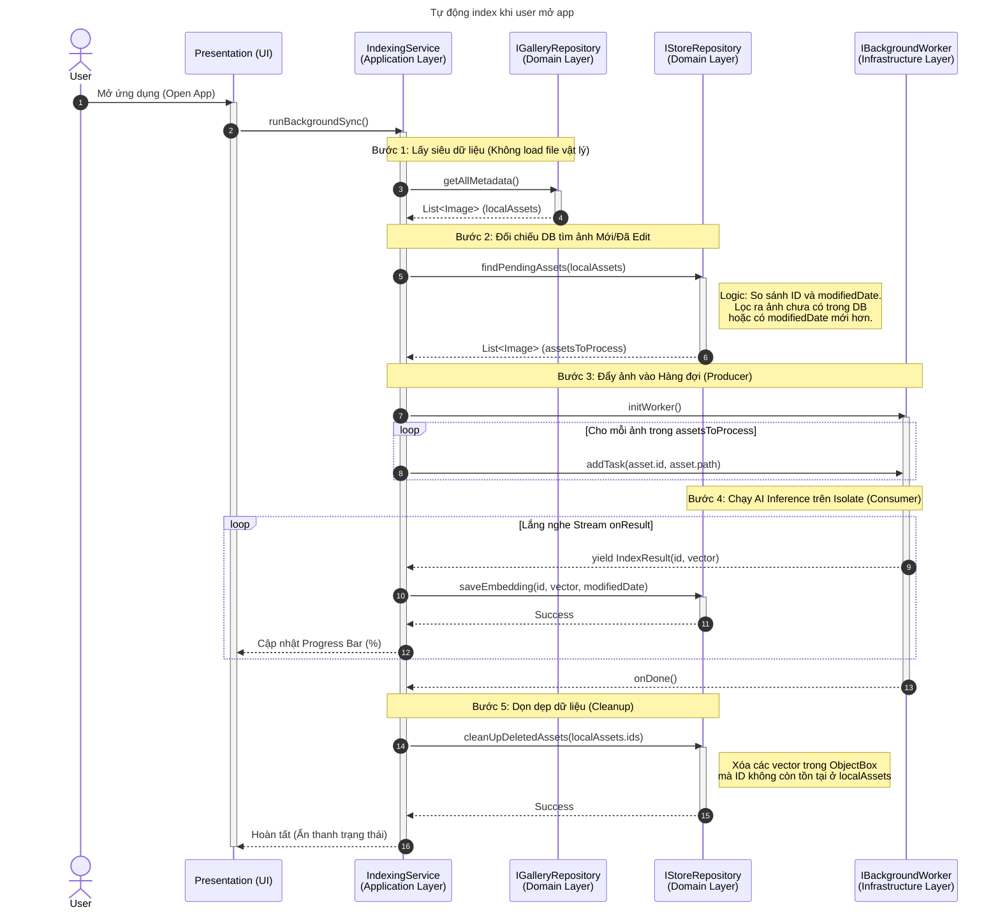
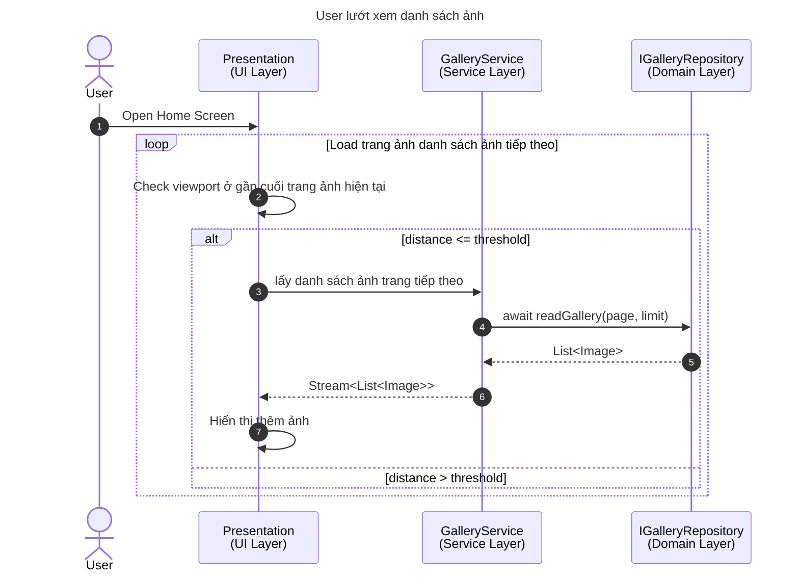
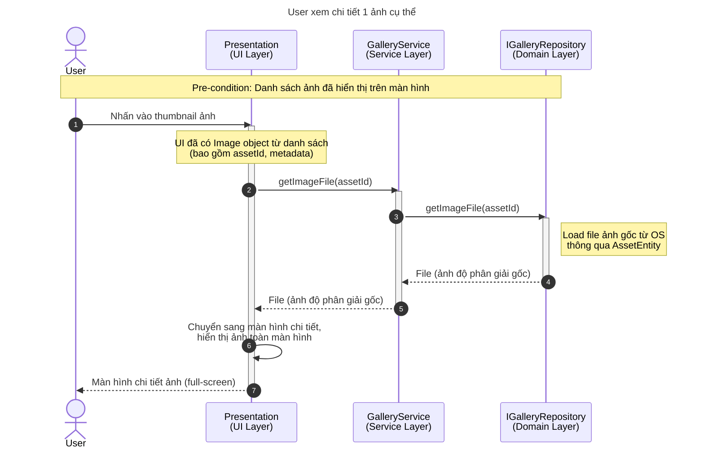
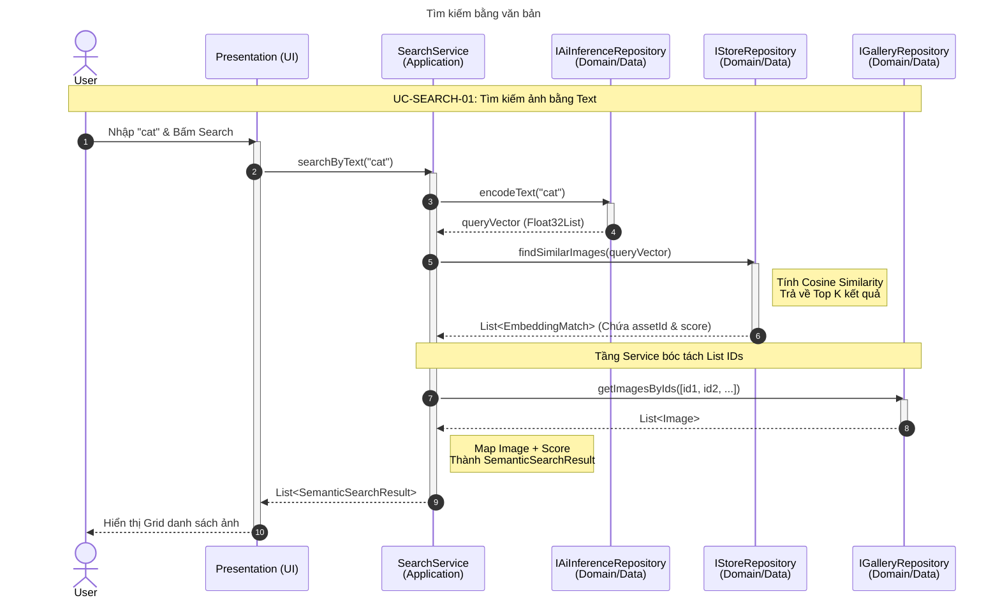
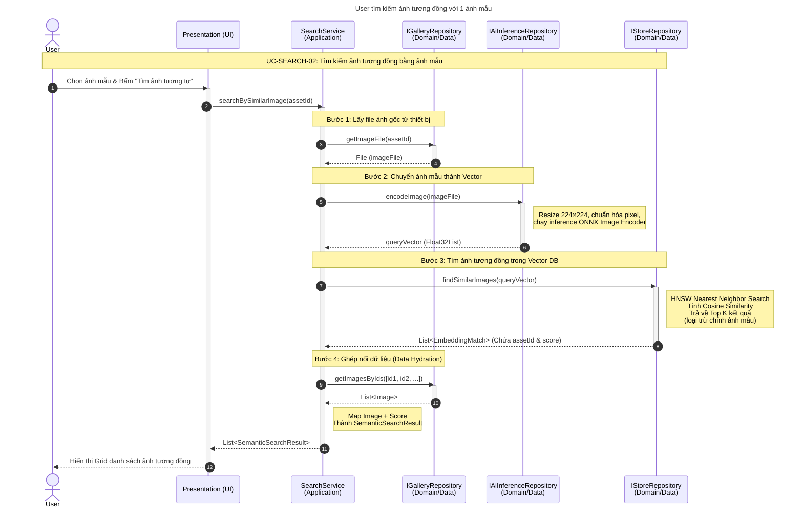
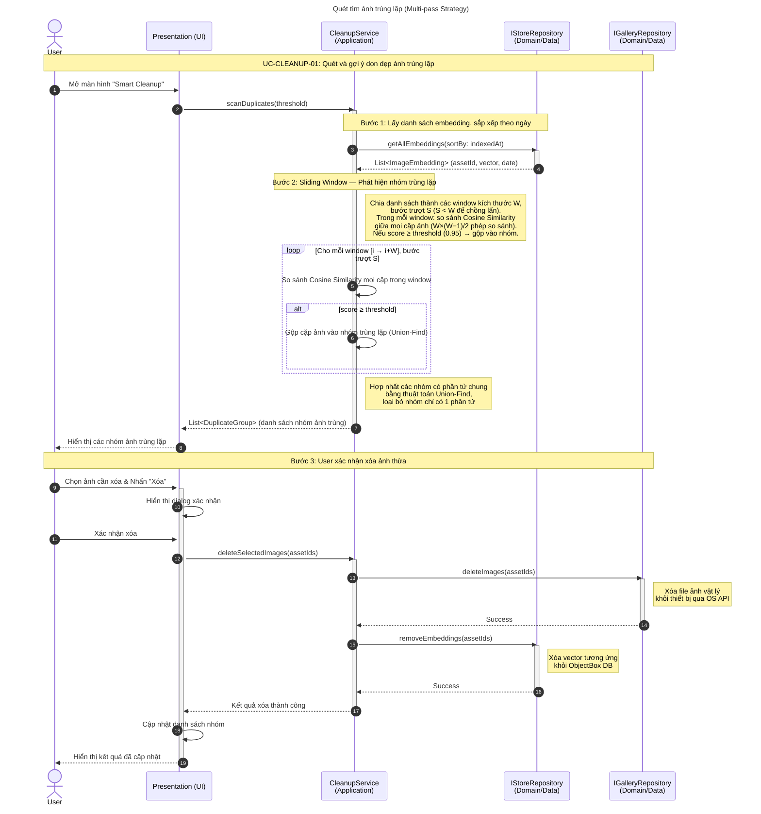

# Software Requirement Specification

| Version | Date       | Description                                                                           |
| ------- | ---------- | ------------------------------------------------------------------------------------- |
| 1.0     | 06/01/2026 |                                                                                       |
| 1.1     | 07/01/2026 | - Thay đổi scope từ chỉ hỗ trợ tiếng Anh sang hỗ trợ đa ngôn ngữ nhờ pretrained model |

- bổ sung mục Data cho use case description của tính năng advanced filtering và smart cleanup
- Bổ sung mục User Story Overview
- Bổ sung mục Data Requirements |
  | 1.2 | 18/01/2026 | - Thay đổi format theo feedback của mentor
- Bổ sung thêm mục Validation and Verification
- Làm rõ hơn các requirement |
  | 1.3 | 23/02/2026 | • Thay đổi cơ chế đa ngôn ngữ, từ dictionary-based (dựa trên file json để map word by word) sang dùng google ml kit on-device translation và chỉ hỗ trợ các gói ngôn ngữ mà người dùng tải về (yêu cầu kết nối mạng để tải gói ngôn ngữ) |
  | 1.4 | 26/02/2026 | • Làm rõ kiến trúc app theo nguyên tắc clean architecture |
  | 1.5 | 05/03/2026 - TBD | • Tiếp tục làm rõ kiến trúc app
  • Thay đổi mô tả sản phẩm thành ứng dụng image gallery
  • Cập nhật tính năng xem ảnh thành quản lý ảnh (tổ chức album, xóa ảnh, chọn nhiều ảnh) |

# 1. Introduction

### 1.1. Purpose

Mục đích của tài liệu này là xác định các yêu cầu phần mềm chi tiết cho ứng dụng "Smart Image Gallery Mobile Application". Tài liệu này mô tả đầy đủ các yêu cầu chức năng (Functional Requirements), yêu cầu phi chức năng (Non-functional Requirements), và các trường hợp sử dụng (Use Cases) của hệ thống.

### 1.2. Product Scope

Sản phẩm là một ứng dụng di động chạy trên nền tảng Android và iOS.

- Hệ thống thực hiện
  - Quản lý kho ảnh trong thiết bị (hỗ trợ duyệt, hiển thị, chọn nhiều ảnh, tạo album và tổ chức ảnh vào album)
  - Quét và đánh chỉ mục (Indexing) toàn bộ thư viện ảnh có sẵn trên thiết bị người dùng.
  - Sử dụng mô hình AI (OpenCLIP) để trích xuất đặc trưng (Vector Embedding) từ hình ảnh và văn bản.
  - Cho phép tìm kiếm ảnh bằng caption tiếng Anh (Semantic Text Search) và tìm
    kiếm bằng hình ảnh tương đồng (Visual Similarity Search) thông qua so sánh bằng công thức cosine similarity.
  - Hoạt động hoàn toàn ngoại tuyến (Offline) đối với dữ liệu ảnh và text người dùng nhập nhằm đảm bảo quyền riêng tư, trường hợp duy nhất yêu cầu kết nối mạng là để tải gói ngôn ngữ cho dịch thuật.

- Hệ thống không thực hiện
  - Đồng bộ ảnh lên Cloud hoặc bất kỳ máy chủ nào.
  - Chỉnh sửa ảnh chuyên sâu (Crop, Filter màu, v.v...).
  - Chia sẻ ảnh trực tiếp lên mạng xã hội từ trong ứng dụng.
  - Không hỗ trợ nhận diện khuôn mặt người cụ thể.

### 1.3. Glossary

- Embedding: mảng số thực biểu diễn đặc trưng ngữ nghĩa của ảnh hoặc văn bản.
- OpenCLIP: nhóm mô hình AI mã nguồn mở phục vụ text-image matching.
- Vector Store: cơ sở dữ liệu chuyên dụng để lưu trữ và tìm kiếm vector.
- Metadata: thông tin đính kèm của file ảnh (ngày chụp, kích thước, tên file).
- Cosine Similarity: công thức đo độ tương đồng giữa 2 vector.

# 2. General Description

## 2.1. Product Feature Overview

Các chức năng chính của hệ thống được tóm tắt như sau:

- **Quản lý index tự động (Automated Indexing):** Tự động đồng bộ và đánh chỉ mục ảnh mới từ thiết bị.
- **Xem ảnh (View Images):** Cho phép user truy cập, xem danh sách các ảnh và xem riêng từng ảnh trong thiết bị.
- **Tìm kiếm ảnh thông minh (Smart Image Search):** Tìm ảnh theo mô tả văn bản (VD: "con mèo dưới nắng") hoặc tìm ảnh giống ảnh mẫu. Ảnh được tìm bằng cách tính và so sánh độ tương đồng, sắp xếp theo thứ tự giảm dần. kết quả có thể được lọc bằng bộ lọc về mặt thời gian chụp ảnh.
- **Gợi ý dọn dẹp (Cleanup Suggestion):** Phát hiện và liệt kê các ảnh trùng lặp hoặc gần giống nhau, người dùng có thể chọn ảnh để xóa, giải phóng dung lượng cho thiết bị.

## 2.2. User Classes and Characteristics

- Người dùng thiết bị di động phổ thông có số lượng ảnh lớn trong máy.
- Người dùng quan tâm đến quyền riêng tư, không muốn upload ảnh lên Cloud
  (Google Photos, iCloud) nhưng vẫn muốn khả năng tìm kiếm thông minh.
- Người dùng không có kiến thức kỹ thuật chuyên sâu.

## 2.3. General Constraints

- **Hardware:** Ứng dụng phải chạy được trên các thiết bị tầm trung trở lên (RAM ≥ 3GB) mà không gây nóng máy quá nhiều hoặc hao pin quá mức.
- **Networking:** Ứng dụng phải hoạt động được không cần internet đối với các tác vụ quản lý ảnh và tìm kiếm.
- **Dung lượng:** Tổng kích thước ứng dụng và model AI đi kèm không vượt quá 600MB.

# 3. System Architecture

## 3.1. Overall System Architecture

Hệ thống được tổ chức theo kiến trúc layer, gồm:

- Presentation Layer: hiển thị thông tin và xử lý tương tác từ user.
- Data Layer: điều phối các tác vụ bằng cách gọi các service, trực tiếp cung cấp dữ liệu cho UI.
- Service Layer: gồm các lớp xử lý chứa logic nghiệp vụ.
- System layer: gồm dữ liệu lưu trữ lâu dài trong thiết bị và các dịch vụ từ hệ điều hành.

## 3.2. Interfaces

## 3.3. Domain Models

# 4. Product Features

Đây là phần mô tả chi tiết các chức năng của hệ thống.

## 4.1. Feature: Tự động index

Khi khởi động và có quyền truy cập, app tự động chạy một quy trình ngầm để scan thư viện ảnh trong thiết bị, lập danh sách những ảnh chưa được tạo chỉ mục, lập chỉ mục trong nền và không block UI. Tính năng này đảm bảo mọi ảnh mới chụp hoặc tải về đều được quản lý bởi AI để phục vụ cho việc tìm kiếm sau này.

### 4.1.1. Functional Requirements

| FR1.1 | Hệ thống phải tự động quét và phát hiện sự thay đổi (ảnh mới thêm, ảnh đã xóa) trong thư viện thiết bị khi khởi động ứng dụng. |
| ----- | ------------------------------------------------------------------------------------------------------------------------------ |
| FR1.2 | Hệ thống phải sử dụng mô hình AI (Image Encoder) để chuyển đổi file ảnh thành vector đặc trưng có chiều tương ứng với model.   |
| FR1.3 | Vector và metadata (ID, ngày chụp) phải được lưu trữ bền vững vào cơ sở dữ liệu cục bộ (ObjectBox).                            |
| FR1.4 | Hệ thống phải loại bỏ các vector tương ứng với các ảnh đã bị người dùng xóa khỏi thiết bị để tránh dữ liệu rác.                |
| FR1.5 | Hiển thị trạng thái Indexing dưới dạng thanh tiến trình kèm số ảnh đã xử lý trên tổng số nếu hệ thống đang xử lý ảnh ngầm.     |

### 4.1.2. Non-Functional Requirements

| NFR1.1 | Performance: Tốc độ xử lý trung bình đạt < 1s/ảnh (gồm resize, inference và lưu vào DB).                  |
| ------ | --------------------------------------------------------------------------------------------------------- |
| NFR1.2 | Performance: Quá trình index phải chạy trên luồng riêng, không block UI, và phải hiển thị tiến độ lên UI. |
| NFR1.3 | Reliability: Nếu gặp ảnh bị lỗi thì phải bỏ qua và ghi log, ứng dụng không được crash.                    |

### 4.1.3. Use Cases

| Name            | Tự động lập chỉ mục cho ảnh trong thư viện khi khởi động app                                                                                                                                                                   |
| --------------- | ------------------------------------------------------------------------------------------------------------------------------------------------------------------------------------------------------------------------------ |
| Actors          | App user                                                                                                                                                                                                                       |
| Description     | User mở app, hệ thống quét kho ảnh trong luồng riêng, đánh dấu những ảnh chưa được lập chỉ mục vào hàng đợi để xử lý, đánh dấu những chỉ mục trong database của ảnh đã bị xóa khỏi thiết bị để chuẩn bị được xóa khỏi database |
| Data            |                                                                                                                                                                                                                                |
| Stimuli         | User mở app                                                                                                                                                                                                                    |
| Response        | Màn hình hiển thị danh sách ảnh trong thiết bị (ảnh chụp gần đây xếp trên, trái sang phải)                                                                                                                                     |
| Pre-conditions  | App đã có quyền truy cập vào kho ảnh trên thiết bị                                                                                                                                                                             |
| Post-conditions | Danh sách ảnh được hiển thị dạng grid trên màn hình                                                                                                                                                                            |

### 4.1.4. Technical Design

## 4.2. Feature: Quản lý ảnh

Cung cấp giao diện trực quan để người dùng duyệt kho ảnh của mình. Đây là màn hình chính của ứng dụng, hiển thị thumbnail ảnh trực tiếp từ thiết bị. Người dùng có thể nhấn vào 1 ảnh để hiển thị ảnh ở độ phân giải gốc, nhấn giữ để chọn nhiều ảnh, tự do di chuyển ảnh vào các album, tạo album. Nếu app chưa có quyền truy cập kho ảnh, hiển thị nút xin quyền.

### 4.2.1. Functional Requirements

| FR2.1 | Hiển thị danh sách ảnh dưới dạng lưới (Grid View) 4 ảnh trên một hàng, sắp xếp theo thứ tự thời gian (mới nhất xếp trước), chia nhóm theo ngày chụp. |
| ----- | ---------------------------------------------------------------------------------------------------------------------------------------------------- |
| FR2.2 | Hiển thị ảnh thu nhỏ (Thumbnail) để tối ưu hiệu quả hiển thị danh sách.                                                                              |
| FR2.3 | Cho phép người dùng chạm vào ảnh để xem ảnh ở độ phân giải gốc.                                                                                      |
| FR2.4 | Chỉ hiển thị ảnh thuộc về album khi người dùng truy cập một album.                                                                                   |
| FR2.5 | Cho phép di chuyển 1 hoặc nhiều ảnh vào các album sẵn có hoặc tạo album mới.                                                                         |

### 4.2.2. Non-Functional Requirements

| NFR2.1 | Performance: Giao diện cuộn (scrolling) phải mượt mà, duy trì tốc độ khung hình 60 FPS.            |
| ------ | -------------------------------------------------------------------------------------------------- |
| NFR2.2 | Performance: Thời gian tải thumbnail phải dưới 1000**ms** khi khung ảnh xuất hiện trong khung nhìn |

### 4.2.3. Use Cases

| Name            | User lướt xem danh sách ảnh                         |
| --------------- | --------------------------------------------------- |
| Actors          | App user                                            |
| Description     | User mở app                                         |
| Data            |                                                     |
| Stimuli         | User mở app                                         |
| Response        | Màn hình hiển thị danh sách ảnh trong thiết bị      |
| Pre-conditions  | App đã có quyền truy cập vào kho ảnh trên thiết bị  |
| Post-conditions | Danh sách ảnh được hiển thị dạng lưới trên màn hình |

| Name            | User xem chi tiết 1 ảnh cụ thể                                                                                    |
| --------------- | ----------------------------------------------------------------------------------------------------------------- |
| Actors          | App user                                                                                                          |
| Description     | User nhấn vào 1 thumbnail ảnh trong danh sách dạng lưới, ảnh được mở bung ra hiển thị rõ nét chiếm toàn màn hình. |
| Data            |                                                                                                                   |
| Stimuli         | User nhấn vào 1 thumbnail ảnh                                                                                     |
| Response        | Ảnh được chọn được hiển thị toàn màn hình ở độ phân giải gốc thay vì thumbnail                                    |
| Pre-conditions  | Danh sách ảnh đã được hiển thị lên màn hình                                                                       |
| Post-conditions | Ứng dụng đang ở màn hình hiển thị ảnh ở độ phân giải gốc                                                          |

| Name            | User xóa ảnh (tạm thời)                                                                |
| --------------- | -------------------------------------------------------------------------------------- |
| Actors          | App user                                                                               |
| Description     | User tạm thời xóa ảnh khỏi thiết bị nhưng có thể sẽ khôi phục lại sau                  |
| Data            | Asset ID của các ảnh cần xóa (String[])                                                |
| Stimuli         | User chọn ≥ 1 ảnh và chọn nút “Xóa ảnh”                                                |
| Response        | Các ảnh được chỉ định biến mất khỏi màn hình danh sách ảnh.                            |
| Pre-conditions  | ≥ 1 ảnh được chọn                                                                      |
| Post-conditions | Các ảnh bị xóa biến mất khỏi màn hình danh sách ảnh và xuất hiện trong mục “Thùng rác” |

| Name            | User xóa ảnh (Hard Delete)                                                                 |
| --------------- | ------------------------------------------------------------------------------------------ |
| Actors          | App user                                                                                   |
| Description     | User xóa ảnh khỏi thiết bị, giải phóng bộ nhớ (không thể khôi phục)                        |
| Data            | Asset ID của các ảnh cần xóa (String[])                                                    |
| Stimuli         | User chọn ≥ 1 ảnh từ màn hình “Thùng rác” và nhấn nút “Xóa vĩnh viễn”                      |
| Response        | Các ảnh được chỉ định biến mất khỏi màn hình “Thùng rác”.                                  |
| Pre-conditions  | App có quyền modify/delete file. User đang ở màn hình “Thùng rác” và có ≥ 1 ảnh được chọn. |
| Post-conditions | Các ảnh được chỉ định không còn trong thiết bị, bộ nhớ được giải phóng dung lượng.         |

| Name            | User tạo/đổi tên album                                       |
| --------------- | ------------------------------------------------------------ |
| Actors          | App user                                                     |
| Description     | User thực hiện các thao tác tạo, đổi tên với thực thể Album. |
| Data            | Tên album (string)                                           |
| Stimuli         | User nhấn nút "Tạo Album" / "Đổi tên" và xác nhận.           |
| Response        | Giao diện cập nhật danh sách Album ngay lập tức.             |
| Pre-conditions  | App có quyền truy cập bộ nhớ. User đang ở tab Albums.        |
| Post-conditions | OS thay đổi cấu trúc thư mục/metadata tương ứng.             |

| Name            | User xóa album                                                                                                         |
| --------------- | ---------------------------------------------------------------------------------------------------------------------- |
| Actors          | App user                                                                                                               |
| Description     | User thực hiện thao tác xóa Album. Lưu ý: Khi xóa Album, user có quyền chọn xóa/không xóa các bức ảnh bên trong album. |
| Data            | Album ID                                                                                                               |
| Stimuli         | User nhấn nút "Xóa Album” và xác nhận.                                                                                 |
| Response        | Giao diện cập nhật danh sách Album ngay lập tức.                                                                       |
| Pre-conditions  | App có quyền truy cập bộ nhớ. User đang ở tab Albums. Một hoặc nhiều album đang được chọn.                             |
| Post-conditions | OS thay đổi cấu trúc thư mục/metadata tương ứng.                                                                       |

| Name            | User di chuyển ảnh vào/ra khỏi album                                                                                       |
| --------------- | -------------------------------------------------------------------------------------------------------------------------- |
| Actors          | App user                                                                                                                   |
| Description     | User chọn nhiều ảnh ở màn hình chính và chọn "Thêm vào Album", hoặc vào trong một Album chọn ảnh và nhấn "Xóa khỏi Album". |
| Data            | asset ID của các ảnh được chọn                                                                                             |
| Stimuli         | User chọn ≥ 1 ảnh, nhấn action "Move to Album" / "Remove from Album".                                                      |
| Response        | Hiển thị snackbar tiến trình vào thông báo thành công/lỗi.                                                                 |
| Pre-conditions  | App có quyền truy cập bộ nhớ. Một hoặc nhiều ảnh đang được chọn.                                                           |
| Post-conditions | Ảnh xuất hiện/biến mất khỏi album được chỉ định.                                                                           |

### 4.2.4. Technical Design

## 4.3. Feature: Tìm kiếm ảnh thông minh

Tính năng cốt lõi cho phép tìm kiếm hình ảnh dựa trên ngôn ngữ tự nhiên. Hỗ trợ tìm kiếm bằng văn bản tự nhiên, tìm kiếm bằng hình ảnh tương đồng và lọc kết quả theo thời gian.

### 4.3.1. Functional Requirements

| FR3.1 | Cho phép nhập văn bản mô tả (giới hạn 200 ký tự), hệ thống chuyển đổi thành vector và so khớp với kho ảnh. Hiện thông báo nhắc nhở nếu user nhập quá số lượng kí tự cho phép. |
| ----- | ----------------------------------------------------------------------------------------------------------------------------------------------------------------------------- |
| FR3.2 | Cho phép chọn một ảnh mẫu và tìm các ảnh có nội dung tương tự.                                                                                                                |
| FR3.3 | Kết quả trả về phải được sắp xếp theo độ tương đồng Cosine (Cosine Similarity Score) từ cao xuống thấp.                                                                       |
| FR3.4 | Cho phép người dùng chọn khoảng thời gian (Start Date - End Date) để lọc kết quả tìm kiếm.                                                                                    |
| FR3.5 | Hiển thị dòng thông báo thích hợp thay vì danh sách dạng lưới nếu không có ảnh trong thiết bị                                                                                 |
| FR3.6 | Nội dung văn bản mô tả phải được lưu trong lịch sử tìm kiếm, giúp người dùng dễ dàng tìm lại ảnh.                                                                             |

### 4.3.2. Non-Functional Requirements

| NFR3.1 | Performance: Thời gian trả về kết quả tìm kiếm phải dưới 2**s** đối với tập dữ liệu 1.000 ảnh |
| ------ | --------------------------------------------------------------------------------------------- |
| NFR3.2 | Performance: Peak RAM usage khi load model AI không được vượt quá 600MB                       |

### 4.3.3. Use Cases

| Name            | User tìm kiếm ảnh bằng mô tả văn bản                                                                                                                                                |
| --------------- | ----------------------------------------------------------------------------------------------------------------------------------------------------------------------------------- |
| Actors          | App user                                                                                                                                                                            |
| Description     | User nhấn vào thanh tìm kiếm, nhập văn bản mô tả bức ảnh cần tìm. Sau khi nhấn nút tìm kiếm, ứng dụng xử lý yêu cầu rồi hiển thị danh sách các ảnh có nội dung tương đồng với mô tả |
| Data            |                                                                                                                                                                                     |
| Stimuli         | User nhập văn bản và nhấn nút tìm kiếm                                                                                                                                              |
| Response        | Danh sách ảnh tương đồng với mô tả được hiển thị ở dạng lưới, 4 ảnh trên một hàng, từ trái sang phải, trên xuống dưới theo thứ tự giảm dần độ tương đồng                            |
| Pre-conditions  | Văn bản mô tả có độ dài > 0 và ≤ 200 kí tự                                                                                                                                          |
| Post-conditions | Ứng dụng đang hiển thị danh sách ảnh tương đồng với mô tả                                                                                                                           |

| Name            | User tìm kiếm ảnh tương đồng với 1 ảnh mẫu                                                                                                                 |
| --------------- | ---------------------------------------------------------------------------------------------------------------------------------------------------------- |
| Actors          | App user                                                                                                                                                   |
| Description     | User chọn 1 ảnh bất kỳ, chọn chức năng tìm kiếm ảnh tương đồng, ứng dụng xử lý và hiển thị danh sách ảnh tương đồng với ảnh mẫu                            |
| Data            |                                                                                                                                                            |
| Stimuli         | User chọn ảnh mẫu và nhấn nút tìm kiếm ảnh tương đồng                                                                                                      |
| Response        | Danh sách ảnh tương đồng với ảnh mẫu được hiển thị ở dạng lưới, 4 ảnh trên một hàng, từ trái sang phải, trên xuống dưới theo thứ tự giảm dần độ tương đồng |
| Pre-conditions  | 1 ảnh bất kỳ được chọn làm ảnh mẫu                                                                                                                         |
| Post-conditions | Ứng dụng đang hiển thị danh sách ảnh tương đồng với ảnh mẫu                                                                                                |

### 4.3.4. Technical Design

## 4.4. Feature: Gợi ý dọn dẹp

Hệ thống phân tích kho ảnh để phát hiện các nhóm ảnh giống nhau, ví dụ như ảnh chụp liên tiếp (Burst shots) hoặc ảnh trùng lặp, giúp người dùng dễ dàng chọn và xóa bớt để giải phóng dung lượng bộ nhớ.

### 4.4.1. Functional Requirements

| FR4.1 | Hệ thống phải tự động gom nhóm các ảnh có độ tương đồng vector lớn hơn ngưỡng quy định (ví dụ Threshold ≥ 0.95), hiển thị lên màn hình và cho phép người dùng chọn nhiều ảnh và xóa. |
| ----- | ------------------------------------------------------------------------------------------------------------------------------------------------------------------------------------ |
| FR4.2 | Sử dụng cách tiếp cận Multi-pass Sliding Window, tránh so sánh với toàn bộ thư viện ảnh gây ngốn bộ nhớ và chậm máy.                                                                 |
| FR4.3 | Thực hiện xóa ảnh vật lý khỏi thiết bị và cập nhật lại Database sau khi người dùng xác nhận.                                                                                         |

### 4.4.2. Non-Functional Requirements

| NFR4.1 | Reliability: Ngưỡng tương đồng phải đủ cao (0.9+) để giảm thiểu rủi ro gợi ý xóa nhầm các ảnh khác nhau. |
| ------ | -------------------------------------------------------------------------------------------------------- |
| NFR4.2 | Performance: Thời gian quét dọn dẹp cho 1.000 ảnh phải hoàn thành trong vòng 10 **giây**.                |

### 4.4.3. Use Cases

| Name            | User xem danh sách gợi ý ảnh trùng lặp                                                                                                                                       |
| --------------- | ---------------------------------------------------------------------------------------------------------------------------------------------------------------------------- |
| Actors          | App user                                                                                                                                                                     |
| Description     | User chọn tính năng “Smart Cleanup Recommendation” trên giao diện, ứng dụng xử lý kho ảnh đã được indexing và hiện thị danh sách ảnh có độ tương đồng cao, xếp theo các nhóm |
| Data            |                                                                                                                                                                              |
| Stimuli         | User nhấn nút tương ứng trên giao diện                                                                                                                                       |
| Response        |                                                                                                                                                                              |
| Pre-conditions  | Vector database đã có ảnh                                                                                                                                                    |
| Post-conditions | Các ảnh có độ tương đồng cao được hiển thị nhóm với nhau                                                                                                                     |

### 4.4.4. Technical Design

# 5. General Non-Functional Requirements

## Modifiability

1. Layered Architecture: hệ thống tuân thủ kiến trúc phân lớp, tách biệt rõ UI, Logic và Data.
2. Modular AI Service: module xử lý AI độc lập, cho phép dễ thay thế model sử dụng mà không ảnh hưởng đến logic.

## Reusability

1. Utility Libraries: tách biệt các hàm xử lý toán học và xử lý ảnh để dùng lại, không hardcode vào business logic cụ thể.

## Reliability & Privacy

1. Offline Work: hệ thống hoạt động 100% ngoại tuyến, không có dữ liệu nào được gửi ra ngoài thiết bị.

# 6. Validation & Verification

## 6.1. Testing Strategy

Chiến lược kiểm thử tập trung vào tính chính xác của thuật toán AI, tính toàn vẹn dữ liệu khi đồng bộ và hiệu năng ứng dụng trên thiết bị di động thực tế.

**Testing Scope**

- Bao gồm: các chức năng hệ thống, hiệu năng (RAM, latency), UI trên Mobile
- Không bao gồm: UI Tablet/Landscape, độ hao hụt pin dài hạn

**Test Levels**

- Unit Testing: kiểm thử các hàm xử lý logic toán học (cosine similarity), hàng đợi.
- Integration Testing: kiểm thử luồng dữ liệu giữa app và database, đảm bảo vector được lưu và truy xuất đúng định dạng.
- System Testing: kiểm thử thủ công trên thiết bị Android thật để đánh giá trải nghiệm người dùng và tính năng.

**Testing Methodologies**

- Manual: đánh giá dựa trên trải nghiệm thực tế của người dùng/tester
- Use tools: sử dụng scripts và log để đánh giá

## 6.2. Acceptance Criteria

Các bảng dưới đây ánh xạ các yêu cầu sang tiêu chí nghiệm thu cụ thể để xác định kết quả Pass/Fail.

Quy ước độ ưu tiên: High (Cốt lõi, bắt buộc phải Pass), Medium (quan trọng, ảnh hưởng lớn đến trải nghiệm người dùng), Low (ít quan trọng)

### Feature: Quản lý index tự động

| Requirement ID | Test Case ID | Priority | Method   | Pass Criteria                                                                                                                                                                                                                                                             |
| -------------- | ------------ | -------- | -------- | ------------------------------------------------------------------------------------------------------------------------------------------------------------------------------------------------------------------------------------------------------------------------- |
| FR1.1          | TC-IDX-01    | High     | Manual   | Mở app, sau khi có quyền truy cập thư viện ảnh, app phải hiện danh sách ảnh có trong thiết bị, sắp xếp theo thứ tự thời gian chụp giảm dần (mới nhất xếp trên, bên trái), tự động hiển thị trạng thái đang loading và cập nhật ảnh cùng với vector tương ứng vào database |
| FR1.3          | TC-IDX-02    | High     | Use tool | Sau khi index, truy vấn database phải trả về đúng số lượng record, mỗi record chứa vector đúng bằng số chiều tương ứng của model (768)                                                                                                                                    |
| FR1.4          | TC-IDX-03    | Medium   | Manual   | Xóa ảnh trong thư viện ảnh của thiết bị, ảnh đó phải biến mất khỏi kết quả tìm kiếm của app và danh sách ảnh hiển thị trên màn hình                                                                                                                                       |
| FR1.5          | TC-IDX-04    | High     | Manual   | Sau khi mở ứng dụng và có ảnh mới trong thư viện ảnh, một thanh trạng thái hiển thị tiến độ indexing hiện ra trên màn hình theo thiết kế UI                                                                                                                               |
| NFR1.1         | TC-IDX-05    | Medium   | Use tool | Đo thời gian index 50 ảnh liên tục, tổng thời gian< 50s                                                                                                                                                                                                                   |
| NFR1.2         | TC-IDX-06    | Medium   | Manual   | Khi sử dụng app và có một lượng ảnh đang trong quá trình index, các thao tác với UI như vuốt để cuộn màn hình hay nhấn nút không được bị đơ cứng, dừng đột ngột                                                                                                           |
| NFR1.3         | TC-IDX-07    | Medium   | Manual   | Thêm file ảnh lỗi (0 byte) vào máy: App không được crash, bỏ qua file lỗi và tiếp tục index các ảnh khác                                                                                                                                                                  |

### Feature: Xem ảnh

| Requirement ID | Test Case ID | Priority | Method            | Pass Criteria                                                                                                                                                                                                                                  |
| -------------- | ------------ | -------- | ----------------- | ---------------------------------------------------------------------------------------------------------------------------------------------------------------------------------------------------------------------------------------------- |
| FR2.1          | TC-VIEW-01   | High     | Manual            | Sau khi mở ứng dụng, danh sách ảnh hiển thị đúng thứ tự thời gian và nhóm lại theo ngày (mới nhất trên cùng, từ trái sang phải), danh sách dạng lưới 4 ô trên một hàng                                                                         |
| FR2.2          | TC-VIEW-02   | High     | Manual            | Sau khi mở ứng dụng, danh sách ảnh hiển thị thumbnail cỡ nhỏ (200x200 px) thay vì ảnh gốc                                                                                                                                                      |
| FR2.3          | TC-VIEW-03   | High     | Manual            | Khi nhấn vào một thumbnail bất kì, ảnh gốc của thumbnail được hiển thị toàn màn hình. Người dùng vuốt ảnh xuống để thoát chế độ hiển thị ảnh toàn màn hình                                                                                     |
| NFR2.1         | TC-VIEW-04   | Medium   | Use tool + Manual | Khi đang ở trong màn hình ứng dụng, các thao tác chuyển cảnh, cuộn màn hình phải đạt 60FPS, số FPS debug ở góc màn hình hiển thị 60FPS trong hầu hết thời gian dùng ap                                                                         |
| NFR2.2         | TC-VIEW-05   | Medium   | Use tool + Manual | Khi mới mở ứng dụng (sau khi đã cấp quyền truy cập thư viện ảnh) hoặc khi cuộn màn hình danh sách ảnh, các khung ảnh mới xuất hiện trong tầm nhìn hiển thị skeleton chỉ trong vòng khoảng thời gian chỉ định trước khi thumbnail được hiển thị |

### Feature: Tìm kiếm ảnh thông minh

| Requirement ID | Test Case ID | Priority | Method | Pass Criteria                                      |
| -------------- | ------------ | -------- | ------ | -------------------------------------------------- |
| FR3.1          | TC-SEARCH-01 | High     | Manual | Khi người dùng nhập văn bản và nhấn nút “Tìm kiếm” |

- Nếu văn bản rỗng: hiện dòng thông báo màu đỏ yêu cầu nhập ít nhất 1 kí tự
- Nếu vượt quá số kí tự cho phép: hiện dòng thông báo với nội dung yêu cầu nhập ít kí tự hơn |
  | FR3.2 | TC-SEARCH-02 | High | Manual | Trong màn hình danh sách ảnh hoặc màn hình xem ảnh, user nhấn vào tùy chọn “Tìm ảnh tương tự”, app xử lý và hiện thị danh sách ảnh sắp xếp theo thứ tự giảm dần về độ tương đồng nội dung với ảnh đã chọn |
  | FR3.3 | TC-SEARCH-03 | High | Manual | Sau khi thực hiện tìm kiếm, danh sách ảnh trả về phải sắp xếp theo thứ tự giảm dần về nội dung so với mô tả/ảnh mẫu.
  Ví dụ: text “con mèo” → kết quả trả về ảnh mèo xếp trên ảnh chó hay các nội dung khác không liên quan đến “con mèo” |
  | FR3.4 | TC-SEARCH-04 | High | Manual | Khi user nhấn tìm kiếm ảnh kèm theo filter khoảng thời gian đã chọn, danh sách kết quả trả về phải lọc đúng, không bao gồm ảnh có thời điểm chụp nằm ngoài phạm vi filter |
  | FR3.5 | TC-SEARCH-05 | High | Manual | Trong trường hợp thiết bị không có ảnh, hiển thị thông báo thích hợp thay vì màn hình kết quả trống rỗng |
  | FR3.6 | TC-SEARCH-06 | Medium | Manual | Khi người dùng nhấn vào thanh tìm kiếm, lịch sử tìm kiếm với top 6 input text gần nhất được hiển thị cùng với thanh tìm kiếm |
  | NFR3.1 | TC-SEARCH-07 | Medium | Use tool | Bấm nút Search (với kho 1000 ảnh), kết quả hiển thị trong vòng 2s |
  | MFR3.2 | TC-SEARCH-08 | High | Use tool | Thực hiện tìm kiếm liên tục 10 lần: RAM Peak của ứng dụng < 600MB (áp dụng với tập dữ liệu tham chiếu 1000 ảnh) |

### Feature: Gợi ý dọn dẹp

| Requirement ID | Test Case ID  | Priority | Method            | Pass Criteria                                                                                                                                                                     |
| -------------- | ------------- | -------- | ----------------- | --------------------------------------------------------------------------------------------------------------------------------------------------------------------------------- |
| FR4.1          | TC-CLEANUP-01 | High     | Use tool + Manual | Kết quả từ script báo pass, từng nhóm hình ảnh hiển thị trên màn hình có nội dung thật sự giống nhau. Người dùng có thể chọn ảnh và xóa.                                          |
| FR4.2          | TC-CLEANUP-02 | High     | Use tool          | Trong quá trình chạy, peak RAM không được quá cao vượt ngưỡng 600MB (áp dụng với tập dữ liệu ảnh tham chiếu 1000 ảnh), báo cáo kết quả trả về toàn bộ danh sách ảnh đã được xử lý |
| FR4.3          | TC-CLEANUP-03 | High     | Manual            | Sau khi xóa, ảnh không được xuất hiện trong thư viện ảnh của thiết bị, không còn hiển thị trong màn hình của app, trong database hoặc một app quản lý ảnh bất kỳ nào khác.        |
| NFR4.1         | TC-CLEANUP-04 | Medium   | Use tool + Manual | Ảnh trong cùng nhóm không quá khác nhau, độ tương đồng giữa các ảnh trong ngưỡng đã đề ra.                                                                                        |
| NFR4.2         | TC-CLEANUP-05 | Medium   | Use tool + Manual | App chỉ được hiển thị trạng thái “đang xử lý” trong vòng tối đa 10 giây rồi phải hiển thị kết quả ngay. (áp dụng với tập dữ liệu ảnh tham chiếu)                                  |
